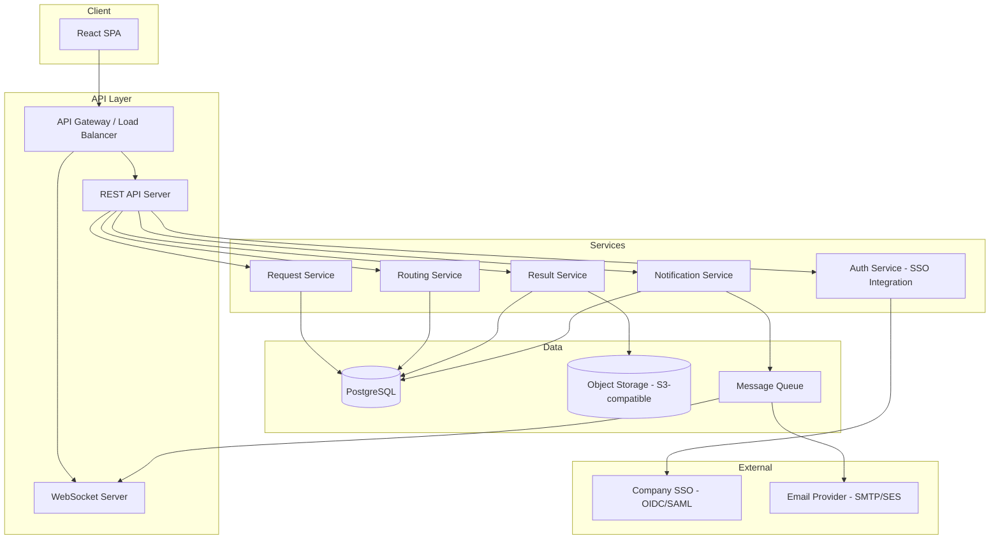

# Design Document: Lab Measurement Request System

## Overview

The Lab Measurement Request System is a web-based platform that manages the full lifecycle of measurement requests from company employees to regional labs. It supports four user roles (Requestor, Lab_Technician, Lab_Manager, Admin), SSO-based authentication, lab routing by method capability and region, result delivery, and multi-channel notifications.

The system is designed as a multi-tier web application with a React frontend, a RESTful API backend, and a relational database. Notifications are delivered via in-app WebSocket push and email. The system must be globally accessible, support concurrent multi-region usage, and retain data for a minimum of 7 years.

### Key Design Goals

- Clear separation of concerns between auth, request lifecycle, routing, and notification subsystems
- Role-based access control enforced at the API layer
- Auditable status transitions with full history
- Pluggable notification channels (in-app + email) with user preferences
- Stateless API tier for horizontal scalability

---

## Architecture



The architecture follows a layered approach:

1. **Client**: Single-page React application communicating over HTTPS REST and WebSocket
2. **API Layer**: Stateless REST API with a separate WebSocket server for real-time push
3. **Services**: Domain services encapsulating business logic
4. **Data**: PostgreSQL for relational data, object storage for result files, message queue for async notifications
5. **External**: Company SSO (OIDC or SAML) and an email provider

---

## Components and Interfaces

### Auth Service

Handles SSO redirect, token validation, session creation, and role resolution.

```
POST /auth/callback          - SSO callback, creates session
GET  /auth/logout            - Invalidates session
GET  /auth/me                - Returns current user + role
```

Session tokens are short-lived JWTs. The SSO provider issues the identity; the system maps the identity to a local user record and role.

### User & Role Management

```
GET    /admin/users                  - List users (Admin only)
PUT    /admin/users/:id/role         - Assign role (Admin only)
GET    /admin/users/:id              - Get user detail (Admin only)
```

Role changes take effect on the user's next authenticated request (JWT re-issue or session refresh).

### Request Service

```
POST   /requests                     - Submit new request (Requestor)
GET    /requests                     - List requests (filtered by role)
GET    /requests/:id                 - Get request detail
PUT    /requests/:id                 - Edit request (Requestor, Submitted status only)
GET    /requests/:id/history         - Get status history
```

### Routing Service

```
GET    /requests/:id/candidates      - List candidate labs for a request
POST   /requests/:id/assign          - Lab_Manager accepts/assigns request
POST   /requests/:id/override-route  - Lab_Manager manual override with reason
```

### Processing Service

```
POST   /requests/:id/assign-technician   - Lab_Manager assigns to technician
POST   /requests/:id/notes               - Lab_Technician adds progress note
POST   /requests/:id/reassign-technician - Lab_Manager reassigns technician
```

### Result Service

```
POST   /requests/:id/results         - Upload result file (Lab_Technician)
GET    /requests/:id/results         - List results
GET    /requests/:id/results/:rid    - Download result file
POST   /requests/:id/acknowledge     - Requestor acknowledges results
```

### Notification Service

```
GET    /notifications                - List in-app notifications for current user
PUT    /notifications/:id/read       - Mark notification read
GET    /users/me/notification-prefs  - Get notification preferences
PUT    /users/me/notification-prefs  - Update notification preferences
```

WebSocket channel: `ws://host/ws` — authenticated via token, receives push events on status changes.

### Lab & Method Administration

```
POST   /admin/labs                   - Create lab (Admin)
PUT    /admin/labs/:id               - Update lab (Admin)
DELETE /admin/labs/:id               - Deactivate lab (Admin)
GET    /admin/labs                   - List labs

POST   /admin/methods                - Create method (Admin)
PUT    /admin/methods/:id            - Update method (Admin)
DELETE /admin/methods/:id            - Deactivate method (Admin)
GET    /admin/methods                - List methods
```

---

## Data Models

### User

```sql
users (
  id            UUID PRIMARY KEY,
  sso_subject   TEXT UNIQUE NOT NULL,       -- SSO identity claim
  email         TEXT NOT NULL,
  display_name  TEXT NOT NULL,
  role          TEXT NOT NULL,              -- Requestor | Lab_Technician | Lab_Manager | Admin
  region        TEXT,                       -- user's geographic region
  created_at    TIMESTAMPTZ NOT NULL,
  updated_at    TIMESTAMPTZ NOT NULL
)
```

### Lab

```sql
labs (
  id            UUID PRIMARY KEY,
  name          TEXT NOT NULL,
  region        TEXT NOT NULL,
  contact_info  JSONB,
  is_active     BOOLEAN NOT NULL DEFAULT TRUE,
  created_at    TIMESTAMPTZ NOT NULL,
  updated_at    TIMESTAMPTZ NOT NULL
)

lab_methods (
  lab_id        UUID REFERENCES labs(id),
  method_id     UUID REFERENCES methods(id),
  PRIMARY KEY (lab_id, method_id)
)
```

### Method

```sql
methods (
  id                  UUID PRIMARY KEY,
  name                TEXT NOT NULL,
  description         TEXT,
  required_material   TEXT,
  is_active           BOOLEAN NOT NULL DEFAULT TRUE,
  created_at          TIMESTAMPTZ NOT NULL,
  updated_at          TIMESTAMPTZ NOT NULL
)
```

### Request

```sql
requests (
  id                  UUID PRIMARY KEY,
  requestor_id        UUID REFERENCES users(id) NOT NULL,
  method_id           UUID REFERENCES methods(id) NOT NULL,
  material_description TEXT NOT NULL,
  purpose_description  TEXT NOT NULL,
  desired_completion   DATE NOT NULL,
  status              TEXT NOT NULL,        -- Submitted | Assigned | In_Progress | Results_Ready | Closed | Unroutable
  assigned_lab_id     UUID REFERENCES labs(id),
  assigned_technician_id UUID REFERENCES users(id),
  routing_override_reason TEXT,
  routing_override_by UUID REFERENCES users(id),
  submitted_at        TIMESTAMPTZ NOT NULL,
  updated_at          TIMESTAMPTZ NOT NULL
)
```

### Request Status History

```sql
request_status_history (
  id            UUID PRIMARY KEY,
  request_id    UUID REFERENCES requests(id) NOT NULL,
  previous_status TEXT,
  new_status    TEXT NOT NULL,
  changed_by    UUID REFERENCES users(id) NOT NULL,
  changed_at    TIMESTAMPTZ NOT NULL
)
```

### Result

```sql
results (
  id            UUID PRIMARY KEY,
  request_id    UUID REFERENCES requests(id) NOT NULL,
  uploaded_by   UUID REFERENCES users(id) NOT NULL,
  file_key      TEXT NOT NULL,              -- object storage key
  file_name     TEXT NOT NULL,
  mime_type     TEXT,
  uploaded_at   TIMESTAMPTZ NOT NULL
)
```

### Notification

```sql
notifications (
  id            UUID PRIMARY KEY,
  user_id       UUID REFERENCES users(id) NOT NULL,
  request_id    UUID REFERENCES requests(id),
  event_type    TEXT NOT NULL,
  message       TEXT NOT NULL,
  is_read       BOOLEAN NOT NULL DEFAULT FALSE,
  created_at    TIMESTAMPTZ NOT NULL
)

notification_preferences (
  user_id       UUID PRIMARY KEY REFERENCES users(id),
  email_enabled BOOLEAN NOT NULL DEFAULT TRUE,
  in_app_enabled BOOLEAN NOT NULL DEFAULT TRUE,
  suppressed_events TEXT[]                  -- event types to suppress
)
```

### Audit Log

```sql
audit_log (
  id            UUID PRIMARY KEY,
  user_id       UUID REFERENCES users(id),
  action        TEXT NOT NULL,
  resource_type TEXT NOT NULL,
  resource_id   UUID,
  detail        JSONB,
  occurred_at   TIMESTAMPTZ NOT NULL
)
```

---

## Correctness Properties

*A property is a characteristic or behavior that should hold true across all valid executions of a system — essentially, a formal statement about what the system should do. Properties serve as the bridge between human-readable specifications and machine-verifiable correctness guarantees.*

### Property 1: Role-Based Access Control Enforcement

*For any* user with a given role, any attempt to access a resource or perform an action outside that role's permissions should result in an authorization error response, and the attempt should be recorded in the audit log.

**Validates: Requirements 2.3, 2.4**

---

### Property 2: Request Submission Validation

*For any* request submission that is missing one or more required fields (Method, Material description, Purpose description, Desired completion date), the system should reject the submission and the error response should identify each missing or invalid field.

**Validates: Requirements 3.1, 3.3**

---

### Property 3: Successful Submission State

*For any* valid request submission, the resulting request record should have a unique identifier not shared by any other request, a recorded submission timestamp, the submitting requestor's identity, and an initial status of "Submitted".

**Validates: Requirements 3.2, 3.4**

---

### Property 4: Status Transition Ordering

*For any* request, the sequence of status values recorded in its history should follow the allowed lifecycle order: Submitted → Assigned → In_Progress → Results_Ready → Closed (with "Unroutable" as a terminal state reachable only from "Submitted"). No status transition outside this ordering should be permitted.

**Validates: Requirements 4.1**

---

### Property 5: Status Change Audit Trail

*For any* status change on any request, the resulting history entry should contain the previous status, the new status, the timestamp of the change, and the identity of the user who triggered the change.

**Validates: Requirements 4.2**

---

### Property 6: Edit Permissions by Status

*For any* request in "Submitted" status, the owning requestor should be permitted to edit its non-identifying fields. *For any* request in "Assigned" or any later status, the same requestor should be denied direct edits without Lab_Manager approval.

**Validates: Requirements 4.3, 4.4**

---

### Property 7: Candidate Lab Capability Filter

*For any* submitted request specifying a given Method, every lab returned as a candidate should have that Method listed among its supported methods, and no inactive lab should appear in the candidate list.

**Validates: Requirements 5.1, 9.2**

---

### Property 8: Candidate Lab Ranking

*For any* set of candidate labs for a request, the labs should be ordered with the requestor's region-proximate labs first, and within the same proximity tier, ordered by ascending count of currently open requests.

**Validates: Requirements 5.2**

---

### Property 9: Assignment State Transition

*For any* request accepted by a Lab_Manager, the request status should become "Assigned" and the accepting lab's identifier should be recorded on the request.

**Validates: Requirements 5.3**

---

### Property 10: Routing Override Audit

*For any* manual routing override performed by a Lab_Manager, the override reason and the Lab_Manager's identity should be persisted on the request record.

**Validates: Requirements 5.5**

---

### Property 11: Technician Assignment and Status Invariant

*For any* request assigned to a Lab_Technician by a Lab_Manager, the request status should become "In_Progress". *For any* reassignment of a technician within the same lab, the request status should remain unchanged (not reset).

**Validates: Requirements 6.1, 6.4**

---

### Property 12: Result Required for Completion

*For any* request in "In_Progress" status, attempting to transition the status to "Results_Ready" without at least one attached result should be rejected by the system.

**Validates: Requirements 6.3**

---

### Property 13: Result File Round Trip

*For any* result file uploaded by a Lab_Technician, downloading that result file should produce byte-for-byte identical content in the same format as the original upload.

**Validates: Requirements 7.2**

---

### Property 14: Acknowledgement Closes Request

*For any* request in "Results_Ready" status, when the requestor acknowledges receipt, the request status should become "Closed" and the acknowledgement timestamp should be recorded.

**Validates: Requirements 7.3**

---

### Property 15: Notification Creation on Status Change

*For any* status change on any request, an in-app notification should be created for every user associated with that request (requestor, assigned technician, lab manager).

**Validates: Requirements 8.1**

---

### Property 16: Email Notification on Key Status Changes

*For any* request that transitions to "Results_Ready", an email notification should be dispatched to the requestor. *For any* request that transitions to "Assigned", an email notification should be dispatched to the assigned Lab_Technician.

**Validates: Requirements 7.1, 8.2**

---

### Property 17: Notification Preference Suppression

*For any* user who has suppressed a notification channel or specific event type in their preferences, notifications matching those suppressed criteria should not be delivered on the suppressed channel.

**Validates: Requirements 8.3**

---

### Property 18: Email Retry on Failure

*For any* email notification that fails to deliver, the system should retry delivery and the total number of attempts should not exceed 4 (1 initial + 3 retries) before logging a delivery failure.

**Validates: Requirements 8.4**

---

### Property 19: Lab Record Round Trip

*For any* lab record created via the admin interface with name, region, supported methods, and contact information, retrieving that lab record should return all the same field values that were provided at creation.

**Validates: Requirements 9.1**

---

### Property 20: Deactivated Method Rejection

*For any* deactivated method, a request submission referencing that method should be rejected by the system.

**Validates: Requirements 9.4**

---

### Property 21: Timezone-Aware Date Display

*For any* date/time value and any user locale/timezone, the formatted display string should include the timezone identifier and represent the correct local time for that timezone.

**Validates: Requirements 10.3**

---

## Error Handling

### Authentication Errors

- Unauthenticated requests to protected endpoints return `401 Unauthorized` with a redirect hint to the SSO login URL
- SSO callback failures return a user-facing error page with a descriptive message; no session is created
- Expired sessions return `401` with the original URL preserved in the redirect parameter

### Authorization Errors

- Requests to resources outside the user's role return `403 Forbidden`
- All `403` responses are written to the audit log with user identity, resource, and timestamp

### Validation Errors

- Missing or invalid request fields return `400 Bad Request` with a structured error body listing each failing field and a human-readable message
- Attempts to reference deactivated methods or labs return `422 Unprocessable Entity` with a descriptive message

### Status Transition Errors

- Illegal status transitions (e.g., skipping a step, transitioning backwards) return `409 Conflict` with the current status and allowed transitions
- Attempting to close a request without results attached returns `422` with a clear message

### Routing Errors

- When no candidate lab supports the requested method, the system sets status to "Unroutable", notifies the requestor and admin, and returns a `200` with the unroutable status (not an HTTP error, as the operation succeeded)

### Notification Delivery Errors

- Email delivery failures are retried up to 3 times with exponential backoff (1s, 2s, 4s delays)
- After 3 failed retries, a delivery failure record is written to the notification log; the in-app notification is unaffected
- WebSocket delivery failures are handled client-side by reconnection with exponential backoff

### File Storage Errors

- Upload failures return `502 Bad Gateway` if the object storage is unreachable
- Download failures for missing file keys return `404 Not Found`

---

## Testing Strategy

### Dual Testing Approach

Both unit tests and property-based tests are required. They are complementary:

- **Unit tests** verify specific examples, integration points, edge cases, and error conditions
- **Property-based tests** verify universal properties across many generated inputs

### Unit Testing

Unit tests should cover:

- SSO callback handling: valid token creates session, invalid token returns error
- Role assignment: assigning a role updates permissions on next request
- Request submission: valid payload creates request, missing fields return correct error fields
- Status transition: each allowed transition succeeds, each disallowed transition is rejected
- Routing: correct candidate labs returned for a given method and region
- Result upload and download: file stored and retrieved correctly
- Notification creation: correct users notified on each status change
- Lab/method deactivation: deactivated entities excluded from routing and submission

### Property-Based Testing

Use a property-based testing library appropriate for the target language (e.g., `fast-check` for TypeScript/JavaScript, `hypothesis` for Python, `QuickCheck` for Haskell, `jqwik` for Java).

Each property test must run a minimum of **100 iterations**.

Each property test must be tagged with a comment in the following format:

```
// Feature: lab-measurement-request-system, Property {N}: {property_text}
```

Property test mapping:

| Property | Test Description |
|----------|-----------------|
| Property 1 | For any role and any out-of-scope endpoint, access is denied and logged |
| Property 2 | For any submission with missing fields, rejection identifies each missing field |
| Property 3 | For any valid submission, result has unique ID, timestamp, requestor, and status "Submitted" |
| Property 4 | For any sequence of status transitions, only allowed orderings are accepted |
| Property 5 | For any status change, history entry contains all four required fields |
| Property 6 | For any request, edit permission matches status (allowed at Submitted, denied at Assigned+) |
| Property 7 | For any method, all candidate labs support that method and none are inactive |
| Property 8 | For any candidate set, ordering follows region proximity then open request count |
| Property 9 | For any accepted request, status becomes Assigned and lab ID is recorded |
| Property 10 | For any routing override, reason and identity are persisted |
| Property 11 | For any technician assignment, status becomes In_Progress; reassignment preserves status |
| Property 12 | For any completion attempt without results, transition is rejected |
| Property 13 | For any uploaded result file, download returns identical bytes |
| Property 14 | For any acknowledgement, status becomes Closed and timestamp is recorded |
| Property 15 | For any status change, in-app notifications are created for all associated users |
| Property 16 | For any Results_Ready transition, requestor email is dispatched; for Assigned, technician email |
| Property 17 | For any suppressed channel/event, no notification is delivered on that channel |
| Property 18 | For any email failure, retry count does not exceed 3 before logging failure |
| Property 19 | For any created lab record, retrieval returns identical field values |
| Property 20 | For any deactivated method, submission referencing it is rejected |
| Property 21 | For any datetime and timezone, formatted output includes timezone identifier |

### Integration Testing

- End-to-end SSO flow with a mock identity provider
- Full request lifecycle from submission through closure
- Notification delivery via WebSocket and email with mock providers
- File upload and download through object storage

### Performance Testing

- Concurrent load test simulating users from 5+ regions
- Verify standard page loads complete within 2 seconds under load
- Notification delivery latency under load (target: within 30 seconds)
